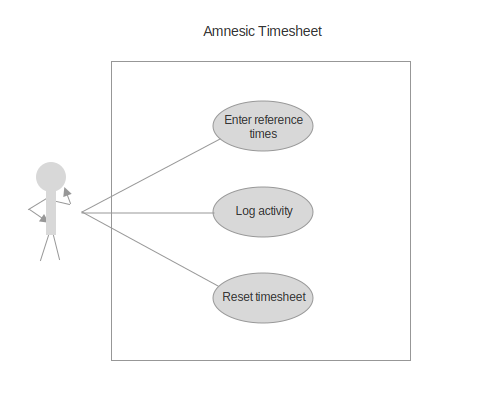

## Functional requirements (F)

Functional requirements outline the functions of the system with
behaviours, inputs and outputs.

The following requirements follow a *use case* form of description.
A use case diagram support the use cases described below.

Actors included in the following requirements include:

- Software Developer (Patrick)

---

### Use cases

  

    

      <label for="f_1_title">Title</label>
    

      
<strong> 📒 F.1. Reset logs</strong>

    

  

  

    

      <label for="f_1_actors">Actor(s)</label>
    

      
Patrick

    

  

  

    

      <label for="f_1_scope">Scope</label>
    

      
Main

    

  

  

    

      <label for="f_1_priority">Priority</label>
    

      
Essential

    

  

  

    

      <label for="f_1_assumptions">Assumptions</label>
    

      
Patrick use the system more than one day.

    

  

  

    

      <label for="f_1_preconditions">Preconditions</label>
    

      
None

    

  

  

    

      <label for="f_1_postconditions">Postconditions</label>
    

      
Patrick is ready to start logging times for today.

    

  

  

    

      <label for="f_1_trigger">Trigger</label>
    

      
Patrick starts a new day at work.

    

  

  

    

      <label for="f_1_main_success_scenario">Main success scenario:</label>
    

      <ol id="f_1_main_success_scenario">
        <li>When Patrick opens the system at the beginning of the day, they see the 
   last entry.</li>
        <li>Patrick resets the timesheet day.</li>
        <li>System forgets the last entry and displays a fresh timesheet.</li>
      </ol>
    

  

  

    

      <label for="f_1_alternative_scenario">Alternative scenario:</label>
    

      

        If Patrick didn't record his time report for the previous day:
      

      <ol>
        <li>Patrick opens the report and copies the information to the other system.</li>
      </ol>
    

  

  

    

      <label for="f_2_title">Title</label>
    

      
<strong> 📒 F.2. Enter reference times</strong>

    

  

  

    

      <label for="f_2_actors">Actor(s)</label>
    

      
Patrick

    

  

  

    

      <label for="f_2_scope">Scope</label>
    

      
Main, 🛋 breaks, 🎞 planning 

    

  

  

    

      <label for="f_2_priority">Priority</label>
    

      
Essential

    

  

  

    

      <label for="f_2_assumptions">Assumptions</label>
    

      
Patrick uses the system for a full day.

    

  

  

    

      <label for="f_2_preconditions">Preconditions</label>
    

      <ul id="f_2_preconditions">
        <li>Patrick has consciously cleared reference times (previous entry) before starting a new day, if a previous entry was present.</li>
        <li>System displays default time values, or it displays time values based on the last entry if Patrick has already used the system. (💡 a double-reset to return to last entry and then default values, to strengthen efficient habits)</li>
      </ul>
    

  

  

    

      <label for="f_2_postconditions">Postconditions</label>
    

      
The end time is computed based on the start time, the total duration and the expected number of breaks.

    

  

  

    

      <label for="f_2_trigger">Trigger</label>
    

      
Patrick starts a new day plan.

    

  

  

    

      <label for="f_2_main_success_scenario">Main success scenario:</label>
    

      <ol id="f_2_main_success_scenario">
        <li>Patrick enters start time.</li>
        <li>Patrick enters target duration.</li>
        <li>Patrick enters expected number of breaks.</li>
        <li>System computes end time.</li>
      </ol>
    

  

  

    

      <label for="f_2_alternative_scenario">Alternative scenario:</label>
    

      

        Patrick adjusts one of the values to reach satisfying end time.
      

    

  

  

    

      <label for="f_3_title">Title</label>
    

      
<strong> 📒 F.3. Log activity</strong>

    

  

  

    

      <label for="f_3_actors">Actor(s)</label>
    

      
Patrick

    

  

  

    

      <label for="f_3_scope">Scope</label>
    

      
Main, 📝 logging, 🛋 breaks, 🗄 report, 🎞 *planning* 

    

  

  

    

      <label for="f_3_priority">Priority</label>
    

      
High

    

  

  

    

      <label for="f_3_assumptions">Assumptions</label>
    

      
Patrick performs one or more work activities.

    

  

  

    

      <label for="f_3_preconditions">Preconditions</label>
    

      <ul id="f_3_preconditions">
        <li>Reference times have been submitted.</li>
    

  

  

    

      <label for="f_3_postconditions">Postconditions</label>
    

      <ul id="f_3_postconditions">
        <li>Time period has been (un)assigned a new activity and marked as completed.</li>
        <li>A new activity appears in the summary, if it didn't already exist, or an activity disappears if it was replaced or removed, and activity total times have been adjusted.</li>
        <li>The total time accounts for activity change (increase if marked as completed or unmarked as break, decrease if unmarked or newly marked as break).</li>
        <li>Break is recorded, if the activity is marked as break.</li>
      </ul>
    

  

  

    

      <label for="f_3_trigger">Trigger</label>
    

      
Patrick completes one or many time periods and wants to log his time.

    

  

  

    

      <label for="f_3_main_success_scenario">Main success scenario:</label>
    

      <ol id="f_3_main_success_scenario">
        <li>Patrick enters short description (only once for contiguous time periods) of the activity performed, at the start of the time period.</li>
        <li>Patrick marks the activity as completed for relevant time periods, from start time period to current time.</li>
        <li>Patrick marks time periods considered as breaks.</li>
        <li>System computes the live summary of time accumulated by activity and the sum of all of them, taking into account breaks.</li>
      </ol>
    

  

  

    

      <label for="f_3_alternative_scenario">Alternative scenario:</label>
    

      <ul id="f_3_alternative_scenario">
        <li>Patrick adjusts one or more time periods by modifying existing description, (un)marking as complete, (un)marking as break.</li>
        <li>Patrick enters more than one description. 💡 Use "//" as a comment for special descriptions that don't count as new activity.</li>
        <li>Patrick enters an activity without marking as complete, to indicate a planned activity.</li>
      

    

  

