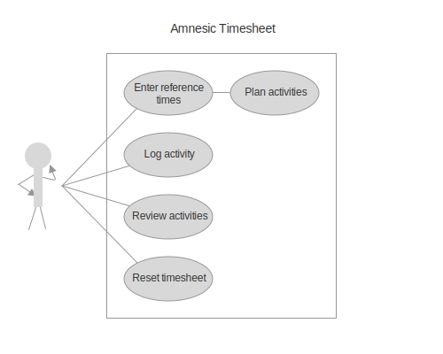

## Functional requirements (F)

Functional requirements outline the functions of the system with
behaviours, inputs and outputs.

The following requirements follow a *use case* form of description.
A use case diagram support the use cases described below.

### Key info

**Actors** included in the following requirements include:

- Software Developer (Patrick)

**Scope** values include:

- 🏎 Main
- 🎞 planning
- 🛋 breaks
- 📝 logging
- 🗄 report

**Priority** values include:

- Essential
- High

---

### Use cases

📒 F.1. Reset logs

- *Actor(s)*: Patrick
- *Scope*: 🏎 Main
- *Priority*: Essential
- *Assumptions*: Patrick uses the system more than one day.
- *Preconditions*: (None)
- *Postconditions*: Patrick is ready to start logging times for today.
- *Trigger*: Patrick starts a new day at work.
- *Main success scenario*:
  1. When Patrick opens the system at the beginning of the day, they see the last entry.
  1. Patrick resets the timesheet day.
  1. System forgets the last entry and displays a fresh timesheet.
- *Alternative scenario*:
  - If Patrick didn't record his time report for the previous day, then Patrick opens the report and copies the information to the other system.

📒 F.2. Enter reference times

- *Actor(s)*: Patrick
- *Scope*: 🏎 Main, 🛋 breaks, 🎞 planning
- *Priority*: Essential
- *Assumptions*: Patrick uses the system more than one day.
- *Preconditions*:
  - Patrick has consciously cleared reference times (previous entry) before starting a new day, if a previous entry was present.
  - System displays default time values, or it displays time values based on the last entry if Patrick has already used the system. (💡 a double-reset to return to last entry and then default values, to strengthen efficient habits)
- *Postconditions*: The end time is computed based on the start time, the target duration and the expected number of breaks.
- *Trigger*: Patrick starts a new day at work.
- *Main success scenario*:
  1. Patrick enters start time.
  1. Patrick enters target duration.
  1. Patrick enters expected number of breaks.
  1. System computes end time.
- *Alternative scenario*:
  1. Patrick adjusts one of the values to reach satisfying end time.
  1. System computes adjusted end time.

📒 F.3. Log activity

- *Actor(s)*: Patrick
- *Scope*: 📝 logging, 🛋 breaks, 🗄 report, 🎞 planning
- *Priority*: High
- *Assumptions*: Patrick performs one or more work activities.
- *Preconditions*: Reference times have been submitted.
- *Postconditions*:
  - Time period has been (un)assigned a new activity and marked as completed.
  - A new activity appears in the summary, if it didn't already exist, or an activity disappears if it was replaced or removed, and activity total times have been adjusted.
  - The total time accounts for activity change (increase if marked as completed or unmarked as break, decrease if unmarked or newly marked as break).
  - Break is recorded, if the activity is marked as break.
- *Trigger*: Patrick completes one or many time periods and wants to log his time.
- *Main success scenario*:
  1. Patrick enters short description (only once for contiguous time periods) of the activity performed, at the start of the time period.
  1. Patrick marks the activity as completed for relevant time periods, from start time period to current time.
  1. Patrick marks time periods considered as breaks.
  1. System computes the live summary of time accumulated by activity and the sum of all of them, taking into account breaks.
- *Alternative scenario*:
  - Patrick adjusts one or more time periods by modifying existing description, (un)marking as complete, (un)marking as break.
  - Patrick enters more than one description. 💡 Use "//" as a comment for special descriptions that don't count as new activity.
  - Patrick enters an activity without marking as complete, to indicate a planned activity.

---

[`..` (Requirements)](./01-00-requirements.md)

1. [Context](./01-01-req-context.md)
1. [Business requirements](./01-02-req-business.md)
1. [User requirements](./01-03-req-user.md)
1. ** [Functional requirements](./01-04-req-functional.md)
1. [Non-functional requirements](./01-05-req-non-functional.md)
1. [Interface requirements](./01-06-req-interface.md)
